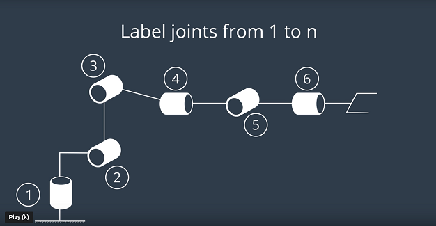
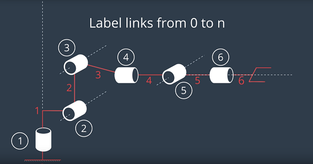
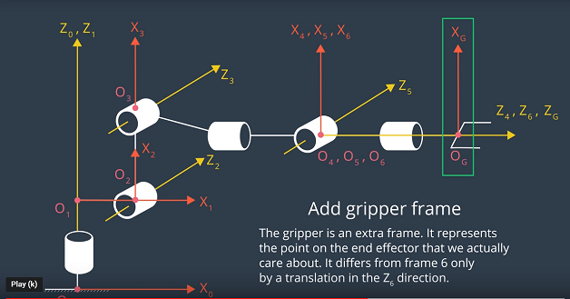

### D.  Forward Kinematics Analysis

#### Analysis

##### Pick-and-Place Walk-Thru Part 1
  1.  Sketch the robot arm into Zero configuration.  The schematic is representative of the Kuka arm when you first spawn the arm in simulation.


  2.  Label the joints from 1 to n with n as 6 since there are 6 joints.


  3.  Define the joint axes

      With joints 2, 3 and 5 are parallel and joints 4 and 6 are coincidents

  4.  Label links from Zero to n


  5.  Define the directions for the positive z axis and x axis

with O(i) = intersection X(i) with Z(i)

  6.  Add a gripper frame


  7.  Show the location of non zero link length

with

      a(i-1) = z(i-1) - z(i) along the x(i-1) axis
      d(i) = x(i-1) - x(i) along the z(i) axis

  8.  Define the twist Angles


##### Getting the a's and d's numerical values
  1.  The URDF file `kr210.urdf.xacro` in `~/catkin_ws/src/RoboND-Kinematics-Project/kuka_arm/urdf` folder contains the position xyz and orientation rpy for each joint from fixed_base_joint (origin) to joint

  You can view the urdf file [here](./kuka_arm/urdf.kr210.xacro).

for fixed base joint (origin)

```xml
  <joint name="fixed_base_joint" type="fixed">
    <parent link="base_footprint"/>
    <child link="base_link"/>
    <origin xyz="0 0 0" rpy="0 0 0"/>
  </joint>
```

for joint_1 (revolute joint, rotating in the z axis, connecting the base link to link 1, origin defines the position and orientation relative to the parent link)

```xml
  <joint name="joint_1" type="revolute">
    <origin xyz="0 0 0.33" rpy="0 0 0"/>
    <parent link="base_link"/>
    <child link="link_1"/>
    <axis xyz="0 0 1"/>
    <limit lower="${-185*deg}" upper="${185*deg}" effort="300" velocity="${123*deg}"/>
  </joint>
```

for joint_2
```xml
  <joint name="joint_2" type="revolute">
    <origin xyz="0.35 0 0.42" rpy="0 0 0"/>
    <parent link="link_1"/>
    <child link="link_2"/>
    <axis xyz="0 1 0"/>
    <limit lower="${-45*deg}" upper="${85*deg}" effort="300" velocity="${115*deg}"/>
  </joint>
```

for joint_3

```xml
  <joint name="joint_3" type="revolute">
    <origin xyz="0 0 1.25" rpy="0 0 0"/>
    <parent link="link_2"/>
    <child link="link_3"/>
    <axis xyz="0 1 0"/>
    <limit lower="${-210*deg}" upper="${(155-90)*deg}" effort="300" velocity="${112*deg}"/>
  </joint>
```

for joint_4

```xml
  <joint name="joint_4" type="revolute">
    <origin xyz="0.96 0 -0.054" rpy="0 0 0"/>
    <parent link="link_3"/>
    <child link="link_4"/>
    <axis xyz="1 0 0"/>
    <limit lower="${-350*deg}" upper="${350*deg}" effort="300" velocity="${179*deg}"/>
  </joint>
```

for joint_5

```xml
  <joint name="joint_5" type="revolute">
    <origin xyz="0.54 0 0" rpy="0 0 0"/>
    <parent link="link_4"/>
    <child link="link_5"/>
    <axis xyz="0 1 0"/>
    <limit lower="${-125*deg}" upper="${125*deg}" effort="300" velocity="${172*deg}"/>
  </joint>
```

for joint_6

```xml
  <joint name="joint_6" type="revolute">
    <origin xyz="0.193 0 0" rpy="0 0 0"/>
    <parent link="link_5"/>
    <child link="link_6"/>
    <axis xyz="1 0 0"/>
    <limit lower="${-350*deg}" upper="${350*deg}" effort="300" velocity="${219*deg}"/>
  </joint>
```

for gripper_joint (fixed joint, origin = 0.0375 meters in the x direction relative to link 6 with the same orientation)

```xml
  <joint name="gripper_joint" type="fixed">
    <parent link="link_6"/>
    <child link="gripper_link"/>
    <origin xyz="0.11 0 0" rpy="0 0 0"/><!--0.087-->
    <axis xyz="0 1 0" />
  </joint>
```

  2.  **You can't display joint reference frames in rViz.  If you turn the robot model off, you see the link reference frame and not the joint reference frame.  The joint origin in the urdf file are not consistent with the frame origins created in accordance with the DH parameter convention nor do they have the same orientation.  You can't display joint reference frame n RViz.**


In the URD file, each joint is defined relative to its parent.

  3.  Refence frame assignments in URDF file

So, from joint 1 to joint 2, translate 0.35 meters in the x direction and 0.42 meters in the z direction.  Each row of the DH parameter, represents the homogeneous transforms between frame i-1 to frame i. In the python code, incrementally check that the position of the reference frame origin are consistent with the cumulative displacement in the URDF file.

  4.  Theta measurements
  

  Only theta 2 is timed variable since the joints are revolute.  The manipulator was drawn in a configuration with all joint angles were assumed to be zero.  But in this case, X1 is not parallel to X2 when theta 2 is zero.  There is a non zero, but constant offset of - 90 degrees.

  5.  Gripper link frames
  
  To compare the total homogeneous transform between the base link and the gripper link, account for the difference in orientation in the gripper link frame.  Apply a sequence of body fix that is intrinsc rotation to the gripper frame in the python code.  Align by rotating by z axis by 180 degrees and at y axis by -90 degrees.


#### Python Code
  1.  Import libraries
  ```
    import numpy as np
    from numpy import array
    from sympy import symbols, cos, sin, pi, simplify, sqrt, atan2
    from sympy.matrices import Matrix
  ```
  2.  Create symbols for joint variables
  ```
  q1, q2, q3, q4, q5, q6, q7 = symbols('q1:8')
  d1, d2, d3, d4, d5, d6, d7 = symbols('d1:8')
  a0, a1, a2, a3, a4, a5, a6 = symbols('a0:7')
  alpha0, alpha1, alpha2, alpha3, alpha4, alpha5, alpha6 = symbols('alpha0:7')
  ```
  
