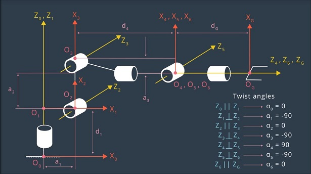
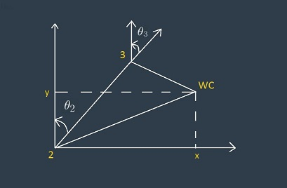
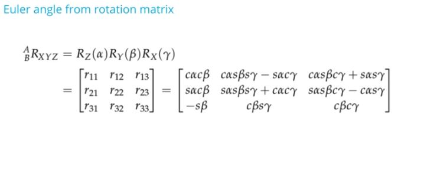
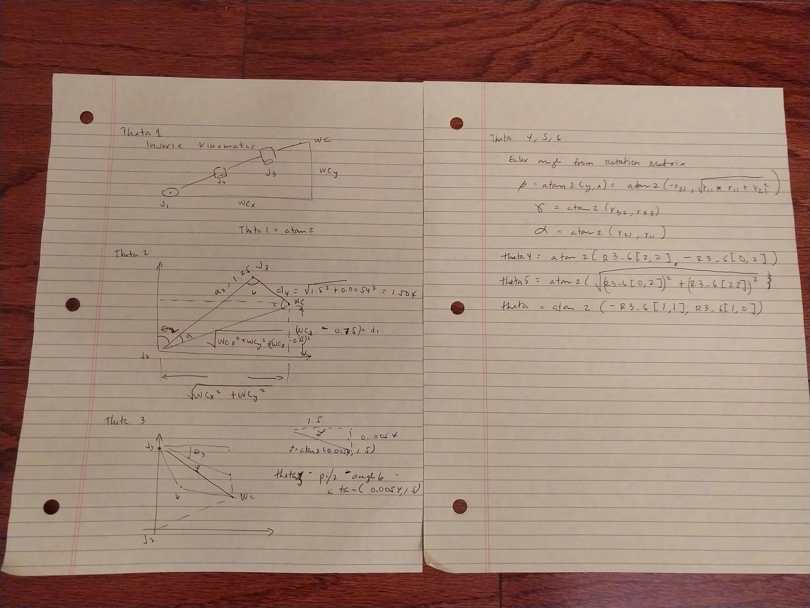

[](https://www.udacity.com/robotics)
# Robotic arm - Pick & Place project

This is the second project for the Robotics 1 class from Udacity.com.  Perform a Kinematics Analysis of a Kuka Arm KR210 with 6 degrees of freedom by picking up an object on a shelf and dropping the object into a bucket.  

This is a good mathematical model for a prototype of an autonomous tennis ball picker robot.

## 1.  Denavit-Hartenberg Diagram of the Kuka Arm KR210 
 From Udacity


 From my notes


## 2.  Denavit-Hartenberg Table

Based on the arm's specifications, the following parameter were derived:

| n |  alpha |   d   |    a   |       q      |
|:-:|:------:|:-----:|:------:|:------------:|
| 0 |   -    |   -   |    0   |       0      |
| 1 | alpha1 |  0.75 |  0.35  |    -pi/2     |
| 2 | alpha2 |   0   |  1.25  |      0       |
| 3 | alpha3 |   0   | -0.054 |    -pi/2     |
| 4 | alpha4 |  1.5  |    0   |     pi/2     |
| 5 | alpha5 |   0   |    0   |    -pi/2     |
| 6 | alpha6 | 0.303 |    0   |      0       |

Legend:
	alpha: Twist angles
	a    : Link length
	d    : Link offset
	q    : joint variables (thetas)

## 3. Homogeneous Transformations - with base_link to link1

    T0_1  = TF_Matrix(alpha0, a0, d1, q1).subs(DH_Table)
    T1_2  = TF_Matrix(alpha1, a1, d2, q2).subs(DH_Table)
    T2_3  = TF_Matrix(alpha2, a2, d3, q3).subs(DH_Table)
    T3_4  = TF_Matrix(alpha3, a3, d4, q4).subs(DH_Table)
    T4_5  = TF_Matrix(alpha4, a4, d5, q5).subs(DH_Table)
    T5_6  = TF_Matrix(alpha5, a5, d6, q6).subs(DH_Table)
    T6_EE = TF_Matrix(alpha6, a6, d7, q7).subs(DH_Table)

with TF_matrix and DH_Table defined as 
```python

    def TF_Matrix(alpha, a, d, q):
        TF = Matrix([[cos(q)           , -sin(q)           , 0          , a            ],
                     [sin(q)*cos(alpha),  cos(q)*cos(alpha), -sin(alpha), -sin(alpha)*d],
                     [sin(q)*sin(alpha),  cos(q)*sin(alpha), +cos(alpha), +cos(alpha)*d],
                     [0                ,  0                , 0          , 1            ]])
        return TF

    DH_Table = { alpha0: 0,      a0: 0,      d1:0.75,  q1:        q1,
                 alpha1: -pi/2., a1: 0.35,   d2:0,     q2: -pi/2.+q2,
                 alpha2: 0,      a2: 1.25,   d3:0,     q3:        q3,
                 alpha3: -pi/2., a3: -0.054, d4:1.5,   q4:        q4,
                 alpha4: +pi/2., a4: 0,      d5:0,     q5:        q5,
                 alpha5: -pi/2., a5: 0,      d6:0,     q6:        q6,
                 alpha6: 0,      a6: 0,      d7:0.303, q7:         0}
```

The full transformation is 
	*T0_EE = simplify(T0_1 * T1_2 * T2_3 * T3_4 * T4_5 * T5_6 * T6_EE)*

Calculate Error

```
    # Read EE position and RPY
    px = req.poses[x].position.x
    py = req.poses[x].position.y
    pz = req.poses[x].position.z
    (roll, pitch, yaw) = tf.transformations.euler_from_quaternion(
                        [req.poses[x].orientation.x,
                         req.poses[x].orientation.y,
                         req.poses[x].orientation.z,
                         req.poses[x].orientation.w])

    # EE rotation Matrix
    r, p, y = symbols('r p y')
    # roll
    ROT_x = Matrix([[1,      0,        0],
                    [0, +cos(r), -sin(r)],
                    [0, +sin(r), +cos(r)]])
    # pitch
    ROT_y = Matrix([[+cos(p), 0, +sin(p)],
                    [0,       1,       0],
                    [-sin(p), 0, +cos(p)]])
    # yaw
    ROT_z = Matrix([[+cos(y), -sin(y), 0],
                    [+sin(y), +cos(y), 0],
                    [      0,       0, 1]])
    ROT_EE = ROT_z * ROT_y * ROT_x

    # EE rotation adjust
    Rot_Error = ROT_z.subs(y, radians(180)) * ROT_y.subs(p, radians(-90))
    ROT_EE = ROT_EE * Rot_Error
    ROT_EE = ROT_EE.subs({'r':roll,'p':pitch,'y':yaw})

    EE = Matrix([[px],
                 [py],
                 [pz]])

    WC = EE - 0.303 * ROT_EE[:,2]
```

## 4. Inverse Kinematics







