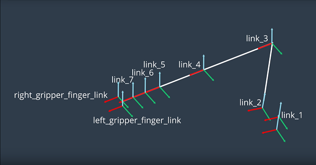
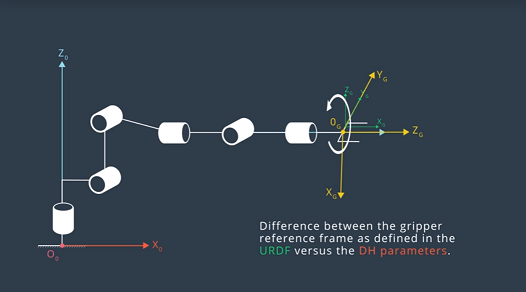

[](https://www.udacity.com/robotics)

# Robotic arm - Pick & Place project


The KUKA KR 210 industrial robot arm is a high payload solution for serious industrial applications. With a high payload of 210 kg and a massive reach of 2700 mm, the KR 210 KR C2 robot is ideal for a foundry setting. In fact, a foundry wrist with IP 67 protection is available with the KR 210 KR C2 instead of the standard IP 65 wrist. (photo and text  www.[robots.com](https://www.robots.com/robots/kuka-kr-210))

To view of a snippet of how this project run, go to this link.  [](https://www.youtube.com/watch?v=y9-X7LLv0Qs)

### A.  Create a Catkin Workspace


1. Download the VM provided by Udacity

2. Create a top level catkin workspace directory and a sub-directory named `src`
```
mkdir -p ~/catkin_ws/src
```
3. Navigate to the `src`
```
cd ~/catkin_ws/src
```
4. Initialize the catkin Workspace
```
catkin_init_workspace
```
Notice that a symbolic link (`CMakeLists.txt`) has been created to
`/opt/ros/kinetic/share/catkin/cmake/toplevel.cmake`


5. Return to the top level directory
```
cd ~/catkin_ws
```
6.  Build the Workspace
```
catkin_make
```
For more information on the catkin build, go to [ROS wiki](http://wiki.ros.org/catkin/conceptual_overview)

------

### B.  Clone the [Project Repository](https://github.com/udacity/RoboND-Kinematics-Project) into the src directory

1. Clone this repository to your home directory.

   ```sh
   $ git clone https://github.com/udacity/RoboND-Kinematics-Project
   ```

2. Now from the terminal window
```
$ cd ~/catkin_ws
$ rosdep install --from-paths src --ignore-src --rosdistro=kinetic -y
$ cd ~/catkin_ws/src/RoboND-Kinematics-Project/kuka_arm/scripts
$ sudo chmod +x target_spawn.py
$ sudo chmod +x IK_server.py
$ sudo chmod +x safe_spawner.sh
```

3.  Build the project
   ```
   $ cd ~/catkin_ws
   $ catkin_make
   ```

4. Add following to your .bashrc file
   ```
   export GAZEBO_MODEL_PATH=~/catkin_ws/src/RoboND-Kinematics-Project/kuka_arm/models

   source ~/catkin_ws/devel/setup.bash
   ```

5. For demo mode make sure the demo flag is set to "true" in inverse_kinematics.launch file under /RoboND-Kinematics-Project/kuka_arm/launch

    In addition, you can also control the spawn location of the target object in the shelf. To do this, modify the spawn_location argument in target_description.launch file under /RoboND-Kinematics-Project/kuka_arm/launch. 0-9 are valid values for spawn_location with 0 being random mode.

    You can launch the project by
   ```sh
   $ cd ~/catkin_ws/src/RoboND-Kinematics-Project/kuka_arm/scripts
   $ ./safe_spawner.sh
   ```

6.  To run your own Inverse Kinematics code change the demo flag described above to "false" and run your code (once the project has successfully loaded) by:
```
$ cd ~/catkin_ws/src/RoboND-Kinematics-Project/kuka_arm/scripts
$ rosrun kuka_arm IK_server.py
```

Note:
Once Gazebo and rviz are up and running, make sure you see following in the gazebo world:
```
  - Robot

  - Shelf

  - Blue cylindrical target in one of the shelves

  - Dropbox right next to the robot
```
If any of these items are missing, report as an issue.

Once all these items are confirmed, open rviz window, hit Next button.

To view the complete demo keep hitting Next after previous action is completed successfully.

Since debugging is enabled, you should be able to see diagnostic output on various terminals that have popped up.

The demo ends when the robot arm reaches at the top of the drop location.

There is no loopback implemented yet, so you need to close all the terminal windows in order to restart.

------

### C.  Development Notes

1. For demo mode, make sure the demo flag is set to true in `inverse_kinematics.launch` file under `~/catkin_ws/src/kuka_arm/launch/`

2. You can also control the spawn location of the target object in the shelf by modifying the spaw_location argument in `target_description.launch` file under `~/catkin_ws/src/kuka_arm/launch`.
0-9 valid values for spawn_location with 0 being random mode.

3. To run forward kinematics test:

   ```sh
   $ roslaunch kuka_arm forward_kinematics.launch
   ```

4. To run simulator:

   ```sh
   $ rosrun kuka_arm safe_spawner.sh
   ```

5. To run IK Server:

   ```sh
   $ rosrun kuka_arm IK_server.py
   ```

### D.  Forward Kinematics Analysis

#### Analysis

   ##### Pick-and-Place Walk-Thru Part 1
     1.  Sketch the robot arm into Zero configuration.  The schematic is representative of the Kuka arm when you first spawn the arm in simulation.
   

     2.  Label the joints from 1 to n with n as 6 since there are 6 joints.
   

     3.  Define the joint axes
   
         With joints 2, 3 and 5 are parallel and joints 4 and 6 are coincidents

     4.  Label links from Zero to n
   

     5.  Define the directions for the positive z axis and x axis
   
   with O(i) = intersection X(i) with Z(i)

     6.  Add a gripper frame
   

     7.  Show the location of non zero link length
   
   with

         a(i-1) = z(i-1) - z(i) along the x(i-1) axis
         d(i) = x(i-1) - x(i) along the z(i) axis

     8.  Define the twist Angles
   

   ##### Getting the a's and d's numerical values
     1.  The URDF file `kr210.urdf.xacro` in `~/catkin_ws/src/RoboND-Kinematics-Project/kuka_arm/urdf` folder contains the position xyz and orientation rpy for each joint from fixed_base_joint (origin) to joint

     You can view the urdf file [here](./kuka_arm/urdf.kr210.xacro).

   for fixed base joint (origin)

   ```xml
     <joint name="fixed_base_joint" type="fixed">
       <parent link="base_footprint"/>
       <child link="base_link"/>
       <origin xyz="0 0 0" rpy="0 0 0"/>
     </joint>
   ```

   for joint_1 (revolute joint, rotating in the z axis, connecting the base link to link 1, origin defines the position and orientation relative to the parent link)

   ```xml
     <joint name="joint_1" type="revolute">
       <origin xyz="0 0 0.33" rpy="0 0 0"/>
       <parent link="base_link"/>
       <child link="link_1"/>
       <axis xyz="0 0 1"/>
       <limit lower="${-185*deg}" upper="${185*deg}" effort="300" velocity="${123*deg}"/>
     </joint>
   ```

   for joint_2
   ```xml
     <joint name="joint_2" type="revolute">
       <origin xyz="0.35 0 0.42" rpy="0 0 0"/>
       <parent link="link_1"/>
       <child link="link_2"/>
       <axis xyz="0 1 0"/>
       <limit lower="${-45*deg}" upper="${85*deg}" effort="300" velocity="${115*deg}"/>
     </joint>
   ```

   for joint_3

   ```xml
     <joint name="joint_3" type="revolute">
       <origin xyz="0 0 1.25" rpy="0 0 0"/>
       <parent link="link_2"/>
       <child link="link_3"/>
       <axis xyz="0 1 0"/>
       <limit lower="${-210*deg}" upper="${(155-90)*deg}" effort="300" velocity="${112*deg}"/>
     </joint>
   ```

   for joint_4

   ```xml
     <joint name="joint_4" type="revolute">
       <origin xyz="0.96 0 -0.054" rpy="0 0 0"/>
       <parent link="link_3"/>
       <child link="link_4"/>
       <axis xyz="1 0 0"/>
       <limit lower="${-350*deg}" upper="${350*deg}" effort="300" velocity="${179*deg}"/>
     </joint>
   ```

   for joint_5

   ```xml
     <joint name="joint_5" type="revolute">
       <origin xyz="0.54 0 0" rpy="0 0 0"/>
       <parent link="link_4"/>
       <child link="link_5"/>
       <axis xyz="0 1 0"/>
       <limit lower="${-125*deg}" upper="${125*deg}" effort="300" velocity="${172*deg}"/>
     </joint>
   ```

   for joint_6

   ```xml
     <joint name="joint_6" type="revolute">
       <origin xyz="0.193 0 0" rpy="0 0 0"/>
       <parent link="link_5"/>
       <child link="link_6"/>
       <axis xyz="1 0 0"/>
       <limit lower="${-350*deg}" upper="${350*deg}" effort="300" velocity="${219*deg}"/>
     </joint>
   ```

   for gripper_joint (fixed joint, origin = 0.0375 meters in the x direction relative to link 6 with the same orientation)

   ```xml
     <joint name="gripper_joint" type="fixed">
       <parent link="link_6"/>
       <child link="gripper_link"/>
       <origin xyz="0.11 0 0" rpy="0 0 0"/><!--0.087-->
       <axis xyz="0 1 0" />
     </joint>
   ```

     2.  **You can't display joint reference frames in rViz.  If you turn the robot model off, you see the link reference frame and not the joint reference frame.  The joint origin in the urdf file are not consistent with the frame origins created in accordance with the DH parameter convention nor do they have the same orientation.  You can't display joint reference frame n RViz.**

   

   In the URD file, each joint is defined relative to its parent.

     3.  Refence frame assignments in URDF file
   
   So, from joint 1 to joint 2, translate 0.35 meters in the x direction and 0.42 meters in the z direction.  Each row of the DH parameter, represents the homogeneous transforms between frame i-1 to frame i. In the python code, incrementally check that the position of the reference frame origin are consistent with the cumulative displacement in the URDF file.

     4.  Theta measurements
     

     Only theta 2 is timed variable since the joints are revolute.  The manipulator was drawn in a configuration with all joint angles were assumed to be zero.  But in this case, X1 is not parallel to X2 when theta 2 is zero.  There is a non zero, but constant offset of - 90 degrees.

     5.  Gripper link frames
     
     To compare the total homogeneous transform between the base link and the gripper link, account for the difference in orientation in the gripper link frame.  Apply a sequence of body fix that is intrinsc rotation to the gripper frame in the python code.  Align by rotating by z axis by 180 degrees and at y axis by -90 degrees.
   

   #### Python Code
  1.  Import libraries
     ```
       import numpy as np
       from numpy import array
       from sympy import symbols, cos, sin, pi, simplify, sqrt, atan2
       from sympy.matrices import Matrix
     ```
  2.  Create symbols for joint variables
     ```
     q1, q2, q3, q4, q5, q6, q7 = symbols('q1:8')
     d1, d2, d3, d4, d5, d6, d7 = symbols('d1:8')
     a0, a1, a2, a3, a4, a5, a6 = symbols('a0:7')
     alpha0, alpha1, alpha2, alpha3, alpha4, alpha5, alpha6 = symbols('alpha0:7')
     ```
  3. DH Parameters
     ```
       DH_Table = {
            alpha0:  0    , a0:  0    , d1:  0.75 , q1:      q1,
            alpha1:  -pi/2, a1:  0.35 , d2:  0    , q2: q2-pi/2,
            alpha2:  0    , a2:  1.25 , d3:  0    , q3:      q3,
            alpha3:  -pi/2, a3: -0.054, d4:  1.50 , q4:      q4,
            alpha4:   pi/2, a4:  0    , d5:  0    , q5:      q5,
            alpha5:  -pi/2, a5:  0    , d6:  0    , q6:      q6,
            alpha6:  0    , a6:  0    , d7:  0.303, q7:       0 }
     ```
     where alpha = twist angles,
           a = link Length,
           b = link offset,
           q = joint variables

  4. Modified Homogeneous transforms
     ```
     def TF_Matrix(alpha, a, d, q):
       TF = Matrix([[cos(q)           , -sin(q)           , 0          , a            ],
                    [sin(q)*cos(alpha),  cos(q)*cos(alpha), -sin(alpha), -sin(alpha)*d],
                    [sin(q)*sin(alpha),  cos(q)*sin(alpha), +cos(alpha), +cos(alpha)*d],
                    [0                ,  0                , 0          , 1            ]])
       return TF
     ```
     Transform matrices
   ```  
   T0_1  = TF_Matrix(alpha0, a0, d1, q1).subs(DH_Table)
   T1_2  = TF_Matrix(alpha1, a1, d2, q2).subs(DH_Table)
   T2_3  = TF_Matrix(alpha2, a2, d3, q3).subs(DH_Table)
   T3_4  = TF_Matrix(alpha3, a3, d4, q4).subs(DH_Table)
   T4_5  = TF_Matrix(alpha4, a4, d5, q5).subs(DH_Table)
   T5_6  = TF_Matrix(alpha5, a5, d6, q6).subs(DH_Table)
   T6_EE = TF_Matrix(alpha6, a6, d7, q7).subs(DH_Table)
   T0_EE = T0_1 * T1_2 * T2_3 * T3_4 * T4_5 * T5_6 * T6_EE
   ```  
  5. Read EE Position and RPY
     ```
     px = req.poses[x].position.x
     py = req.poses[x].position.y
     pz = req.poses[x].position.z
     (roll, pitch, yaw) = tf.transformations.euler_from_quaternion(
                         [req.poses[x].orientation.x,
                          req.poses[x].orientation.y,
                          req.poses[x].orientation.z,
                          req.poses[x].orientation.w])
     ```
  6. EE rotation Matrix
     ```
     r, p, y = symbols('r p y')
     # roll
     ROT_x = Matrix([[1,      0,        0],
                   [0, +cos(r), -sin(r)],
                   [0, +sin(r), +cos(r)]])
     # pitch
     ROT_y = Matrix([[+cos(p), 0, +sin(p)],
                   [0,       1,       0],
                   [-sin(p), 0, +cos(p)]])
     # yaw
     ROT_z = Matrix([[+cos(y), -sin(y), 0],
                   [+sin(y), +cos(y), 0],
                   [      0,       0, 1]])
     ROT_EE = ROT_z * ROT_y * ROT_x
     ```
  7.  EE rotation adjust
     ```
     Rot_Error = ROT_z.subs(y, radians(180)) * ROT_y.subs(p, radians(-90))
     ROT_EE = ROT_EE * Rot_Error
     ROT_EE = ROT_EE.subs({'r':roll,'p':pitch,'y':yaw})

     EE = Matrix([[px],
                [py],
                [pz]])

     WC = EE - 0.303 * ROT_EE[:,2]
     ```
  8.  IK -> Calculate joint Angles
   ```
   theta1 = atan2(WC[1],WC[0])

   # find the 3rd side of the triangle
   A = 1.501
   C = 1.25
   B = sqrt(pow((sqrt(WC[0]*WC[0] + WC[1]*WC[1]) - 0.35), 2) + pow((WC[2] - 0.75), 2))

   #Cosine Laws SSS to find all inner angles of the triangle
   a = acos((B*B + C*C - A*A) / (2*B*C))
   b = acos((A*A + C*C - B*B) / (2*A*C))
   c = acos((A*A + B*B - C*C) / (2*A*B))

   #Find theta2 and theta3
   theta2 = pi/2 - a - atan2(WC[2]-0.75, sqrt(WC[0]*WC[0]+WC[1]*WC[1])-0.35)
   theta3 = pi/2 - (b+0.036) # 0.036 accounts for sag in link4 of -0.054m

   # Extract rotation matrix R0_3 from transformation matrix T0_3 the substitute angles q1-3
   R0_3 = T0_1[0:3,0:3] * T1_2[0:3,0:3] * T2_3[0:3,0:3]
   R0_3 = R0_3.evalf(subs={q1: theta1, q2: theta2, q3:theta3})

   # Get rotation matrix R3_6 from (transpose of R0_3 * R_EE)
   R3_6 = R0_3.transpose() * ROT_EE
   ```  
     9 Euler Angles
  ```
     theta5 = atan2(sqrt(R3_6[0,2]*R3_6[0,2] + R3_6[2,2]*R3_6[2,2]),R3_6[1,2])

     # select best solution based on theta5
     if (theta5 > pi) :
         theta4 = atan2(-R3_6[2,2], R3_6[0,2])
         theta6 = atan2(R3_6[1,1],-R3_6[1,0])
     else:
         theta4 = atan2(R3_6[2,2], -R3_6[0,2])
         theta6 = atan2(-R3_6[1,1],R3_6[1,0])
```
#### E. Final Step

1. Insert kinematics code to IK_server.py located in the `~\catkin_ws\src\RoboND-Kinematics-Project\kuka_arm\script`

2.  You can launch the project by
```
$ cd ~/catkin_ws/src/RoboND-Kinematics-Project/kuka_arm/scripts
$ ./safe_spawner.sh
```

3.  If you are running in demo mode, this is all you need. To run your own Inverse Kinematics code change the demo flag described above to "false" and run your code (once the project has successfully loaded) by:
```
$ cd ~/catkin_ws/src/RoboND-Kinematics-Project/kuka_arm/scripts
$ rosrun kuka_arm IK_server.py
```
#### F. Final thoughts
This has been my first "academic" paper in over 25 years.  I am late in completing this project, since this project requires a good knowledge of python, numpy, forward/inverse kinematics, linear algebra and trigonometry.  The only thing I know on those prerequisites are linear algebra and trig.  I have to catch up on the rest.  It would also help if you know git and markdown format before you take on this course.  I'll visit the code later for further efficiency because sometimes the robot looks like it's drunk.
