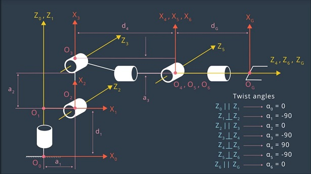
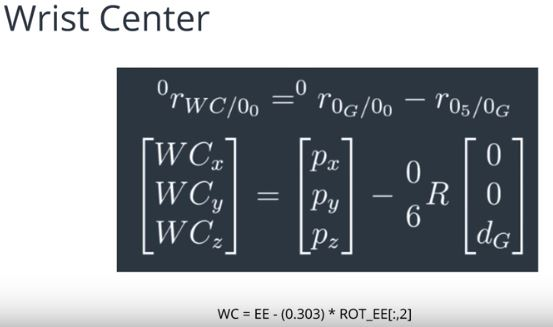
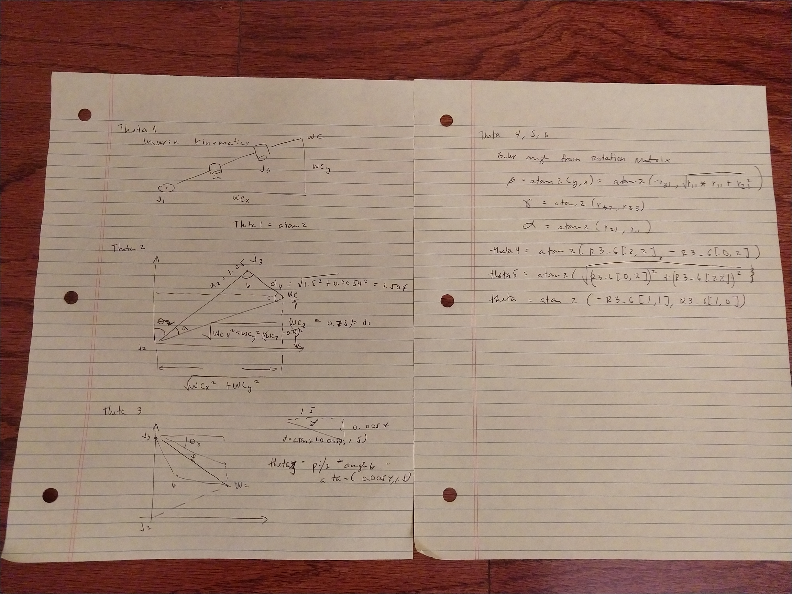
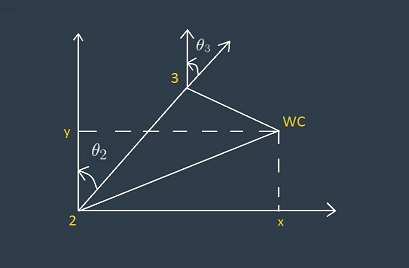
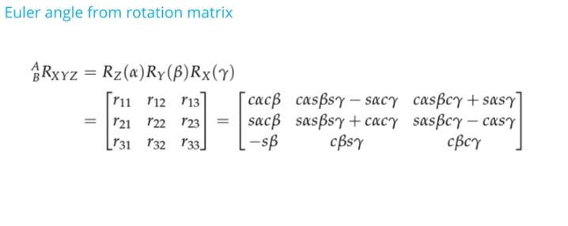

[](https://www.udacity.com/robotics)
# Robotic arm - Pick & Place project

This is the second project for the Robotics 1 class from Udacity.com.  Perform a Kinematics Analysis of a Kuka Arm KR210 with 6 degrees of freedom by picking up an object on a shelf and dropping the object into a bucket.  

This is a good mathematical model for a prototype of an autonomous tennis ball picker robot.

## 1.  Denavit-Hartenberg Diagram of the Kuka Arm KR210 
 From Udacity


 From my notes


## 2.  Denavit-Hartenberg Table

Based on the arm's specifications, the following parameter were derived:

| n |  alpha |   d   |    a   |       q      |
|:-:|:------:|:-----:|:------:|:------------:|
| 0 |   -    |   -   |    0   |       0      |
| 1 | alpha1 |  0.75 |  0.35  |    -pi/2     |
| 2 | alpha2 |   0   |  1.25  |      0       |
| 3 | alpha3 |   0   | -0.054 |    -pi/2     |
| 4 | alpha4 |  1.5  |    0   |     pi/2     |
| 5 | alpha5 |   0   |    0   |    -pi/2     |
| 6 | alpha6 | 0.303 |    0   |      0       |

Legend:
	alpha: Twist angles
	a    : Link length
	d    : Link offset
	q    : joint variables (thetas)

## 3. Homogeneous Transformations - with base_link to link1

    T0_1  = TF_Matrix(alpha0, a0, d1, q1).subs(DH_Table)
    T1_2  = TF_Matrix(alpha1, a1, d2, q2).subs(DH_Table)
    T2_3  = TF_Matrix(alpha2, a2, d3, q3).subs(DH_Table)
    T3_4  = TF_Matrix(alpha3, a3, d4, q4).subs(DH_Table)
    T4_5  = TF_Matrix(alpha4, a4, d5, q5).subs(DH_Table)
    T5_6  = TF_Matrix(alpha5, a5, d6, q6).subs(DH_Table)
    T6_EE = TF_Matrix(alpha6, a6, d7, q7).subs(DH_Table)

with TF_matrix and DH_Table defined as 
```python

    def TF_Matrix(alpha, a, d, q):
        TF = Matrix([[cos(q)           , -sin(q)           , 0          , a            ],
                     [sin(q)*cos(alpha),  cos(q)*cos(alpha), -sin(alpha), -sin(alpha)*d],
                     [sin(q)*sin(alpha),  cos(q)*sin(alpha), +cos(alpha), +cos(alpha)*d],
                     [0                ,  0                , 0          , 1            ]])
        return TF

    DH_Table = { alpha0: 0,      a0: 0,      d1:0.75,  q1:        q1,
                 alpha1: -pi/2., a1: 0.35,   d2:0,     q2: -pi/2.+q2,
                 alpha2: 0,      a2: 1.25,   d3:0,     q3:        q3,
                 alpha3: -pi/2., a3: -0.054, d4:1.5,   q4:        q4,
                 alpha4: +pi/2., a4: 0,      d5:0,     q5:        q5,
                 alpha5: -pi/2., a5: 0,      d6:0,     q6:        q6,
                 alpha6: 0,      a6: 0,      d7:0.303, q7:         0}
```

The full transformation is 
	*T0_EE = simplify(T0_1 * T1_2 * T2_3 * T3_4 * T4_5 * T5_6 * T6_EE)*

Calculate Error

```
    # Read EE position and RPY
    px = req.poses[x].position.x
    py = req.poses[x].position.y
    pz = req.poses[x].position.z
    (roll, pitch, yaw) = tf.transformations.euler_from_quaternion(
                        [req.poses[x].orientation.x,
                         req.poses[x].orientation.y,
                         req.poses[x].orientation.z,
                         req.poses[x].orientation.w])

    # EE rotation Matrix
    r, p, y = symbols('r p y')
    # roll
    ROT_x = Matrix([[1,      0,        0],
                    [0, +cos(r), -sin(r)],
                    [0, +sin(r), +cos(r)]])
    # pitch
    ROT_y = Matrix([[+cos(p), 0, +sin(p)],
                    [0,       1,       0],
                    [-sin(p), 0, +cos(p)]])
    # yaw
    ROT_z = Matrix([[+cos(y), -sin(y), 0],
                    [+sin(y), +cos(y), 0],
                    [      0,       0, 1]])
    ROT_EE = ROT_z * ROT_y * ROT_x

    # EE rotation adjust
    Rot_Error = ROT_z.subs(y, radians(180)) * ROT_y.subs(p, radians(-90))
    ROT_EE = ROT_EE * Rot_Error
    ROT_EE = ROT_EE.subs({'r':roll,'p':pitch,'y':yaw})

    EE = Matrix([[px],
                 [py],
                 [pz]])

    WC = EE - 0.303 * ROT_EE[:,2]
```

## 4. Inverse Kinematics
a. Calculate the location of the spherical wrist center (WC) for the Theta 4, Thate 5 or Theta 6 in the DH model with the formula

  

b. Use trigonometry to solve for the first 3 joint angles.

Left Page




c.  Solve for the next 6 angles.



Right Page


## 5. Running IK_Server.py

I am still having problems with this project.  I have tried different versions of IK_server.py from other folks and the results are the same.  It seems like the environment has a problem in going from the shelf to the bucket.  Also, I have tried different machines (2 window 10 and 1 windows 8.1) but running the VM.  The problem is show in this video (https://www.youtube.com/watch?v=jyzpiJApB1Q).  My next step would be to install the project in a native linux box.  That means installing Ubuntu, ROS, Gazebo and RVIZ manually.

  


##  Setting up the VM
Make sure you are using robo-nd VM or have Ubuntu+ROS installed locally.

### One time Gazebo setup step:
Check the version of gazebo installed on your system using a terminal:
```sh
$ gazebo --version
```
To run projects from this repository you need version 7.7.0+
If your gazebo version is not 7.7.0+, perform the update as follows:
```sh
$ sudo sh -c 'echo "deb http://packages.osrfoundation.org/gazebo/ubuntu-stable `lsb_release -cs` main" > /etc/apt/sources.list.d/gazebo-stable.list'
$ wget http://packages.osrfoundation.org/gazebo.key -O - | sudo apt-key add -
$ sudo apt-get update
$ sudo apt-get install gazebo7
```

Once again check if the correct version was installed:
```sh
$ gazebo --version
```
### For the rest of this setup, catkin_ws is the name of active ROS Workspace, if your workspace name is different, change the commands accordingly

If you do not have an active ROS workspace, you can create one by:
```sh
$ mkdir -p ~/catkin_ws/src
$ cd ~/catkin_ws/
$ catkin_make
```

Now that you have a workspace, clone or download this repo into the **src** directory of your workspace:
```sh
$ cd ~/catkin_ws/src
$ git clone https://github.com/udacity/RoboND-Kinematics-Project.git
```

Now from a terminal window:

```sh
$ cd ~/catkin_ws
$ rosdep install --from-paths src --ignore-src --rosdistro=kinetic -y
$ cd ~/catkin_ws/src/RoboND-Kinematics-Project/kuka_arm/scripts
$ sudo chmod +x target_spawn.py
$ sudo chmod +x IK_server.py
$ sudo chmod +x safe_spawner.sh
```
Build the project:
```sh
$ cd ~/catkin_ws
$ catkin_make
```

Add following to your .bashrc file
```
export GAZEBO_MODEL_PATH=~/catkin_ws/src/RoboND-Kinematics-Project/kuka_arm/models

source ~/catkin_ws/devel/setup.bash
```

For demo mode make sure the **demo** flag is set to _"true"_ in `inverse_kinematics.launch` file under /RoboND-Kinematics-Project/kuka_arm/launch

In addition, you can also control the spawn location of the target object in the shelf. To do this, modify the **spawn_location** argument in `target_description.launch` file under /RoboND-Kinematics-Project/kuka_arm/launch. 0-9 are valid values for spawn_location with 0 being random mode.

You can launch the project by
```sh
$ cd ~/catkin_ws/src/RoboND-Kinematics-Project/kuka_arm/scripts
$ ./safe_spawner.sh
```

If you are running in demo mode, this is all you need. To run your own Inverse Kinematics code change the **demo** flag described above to _"false"_ and run your code (once the project has successfully loaded) by:
```sh
$ cd ~/catkin_ws/src/RoboND-Kinematics-Project/kuka_arm/scripts
$ rosrun kuka_arm IK_server.py
```
Once Gazebo and rviz are up and running, make sure you see following in the gazebo world:

	- Robot
	
	- Shelf
	
	- Blue cylindrical target in one of the shelves
	
	- Dropbox right next to the robot
	

If any of these items are missing, report as an issue.

Once all these items are confirmed, open rviz window, hit Next button.

To view the complete demo keep hitting Next after previous action is completed successfully. 

Since debugging is enabled, you should be able to see diagnostic output on various terminals that have popped up.

The demo ends when the robot arm reaches at the top of the drop location. 

There is no loopback implemented yet, so you need to close all the terminal windows in order to restart.

In case the demo fails, close all three terminal windows and rerun the script.

